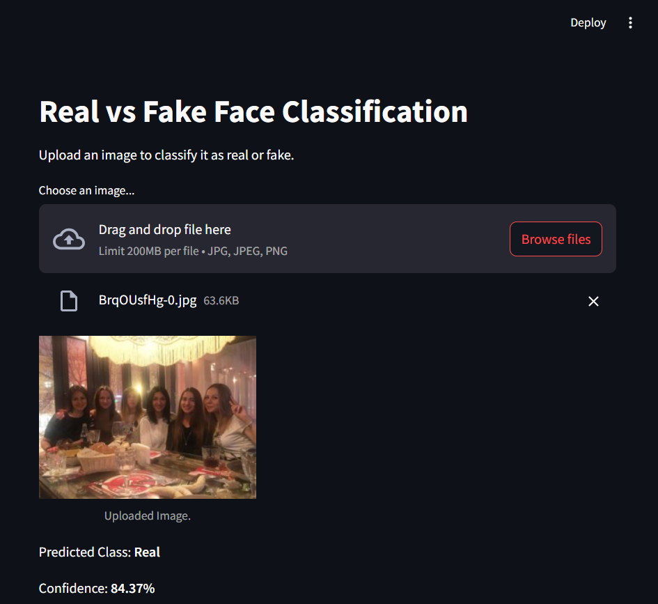
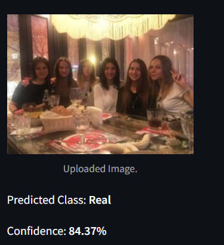

# Real vs Fake Face Classification



## Overview

Real vs Fake Face Classification is a powerful tool that leverages deep learning to distinguish between real human faces and AI-generated (fake) ones. In today's world, where AI-generated images are becoming increasingly sophisticated, this tool helps ensure the authenticity of visual content. For instance, if someone were to create a fake image by inserting your face into a compromising situation or photoshopping it onto someone else's body, this tool will accurately classify the image as fake, thus protecting your reputation.

Simply upload the image, and the machine learning model will evaluate it and provide a response within seconds. This tool is designed to be user-friendly, with a clean and intuitive interface, making it accessible to everyone.

🤖 Machine Learning Process

📊 Getting the Data and EDA Process
The dataset used was NVIDIA-140K, which contains 70K real and 70K AI-generate images.



### Features

- **Upload Images**: Users can upload in JPG, JPEG, or PNG formats.
- **Classification**: The model predict whether the uploaded image is real or AI-generated.
- **Confidence Score**: The app provides a confidence score for the classification.

## Usage

### 1. Clone the repository:
```bash
https://github.com/princ0301/Real-vs-Fake-Human-Face-Classification
cd Real-vs-Fake-Classification
```

## 2. Installation
```bash
pip install -r requirements.txt
```

## 3. Run the Streamlit app:
```gd
streamlit run application.py
```
## 4. Upload an image:
Upload an image to the interface to classify it as "Real" or "Fake" with a confidence score.
